# TimeSheet & Leave Management System Architecture Diagrams

This file collects high-level and low-level architecture diagrams for the project.
You can paste these Mermaid diagrams into Markdown renderers, Mermaid Live Editor, or presentation tools that support Mermaid.

## 1. High-Level System Architecture

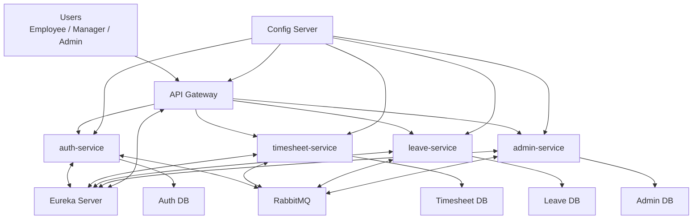

## 2. Deployment / Infrastructure View

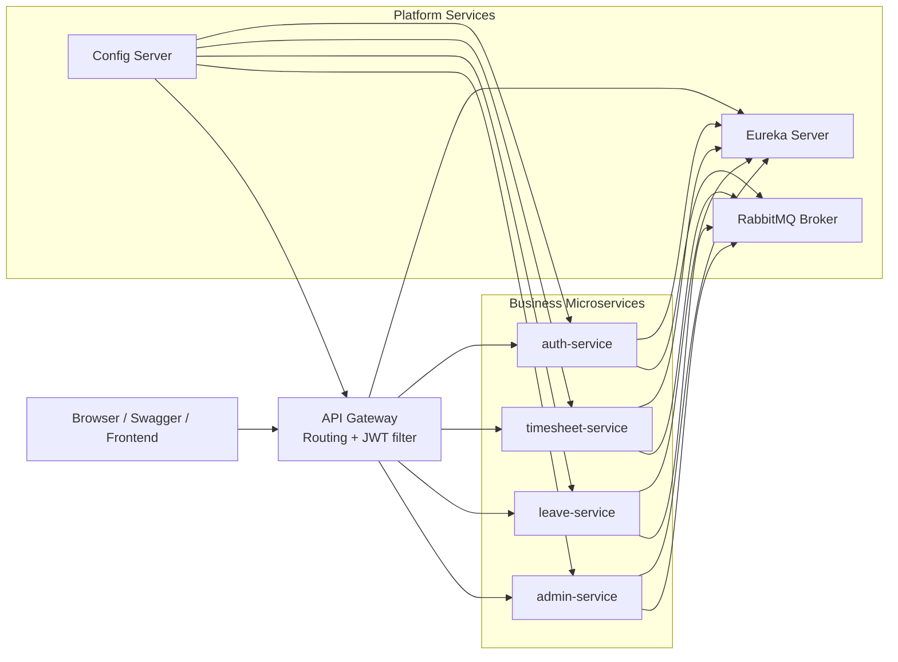

## 3. Service Ownership

```mermaid
flowchart TD
    A["auth-service"] --> A1["Registration"]
    A --> A2["Login / JWT"]
    A --> A3["Profile"]
    A --> A4["Manager Assignment"]

    T["timesheet-service"] --> T1["Projects"]
    T --> T2["Timesheet Entries"]
    T --> T3["Weekly Timesheets"]
    T --> T4["Submit / Approve / Reject"]

    L["leave-service"] --> L1["Leave Requests"]
    L --> L2["Leave Balances"]
    L --> L3["Policies"]
    L --> L4["Holidays"]

    AD["admin-service"] --> D1["Approval Queue"]
    AD --> D2["Dashboards"]
    AD --> D3["Reports"]
    AD --> D4["Notifications"]
```

## 4. Common Internal Service Pattern

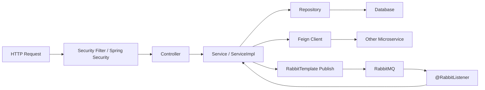

## 5. API Gateway Routing View

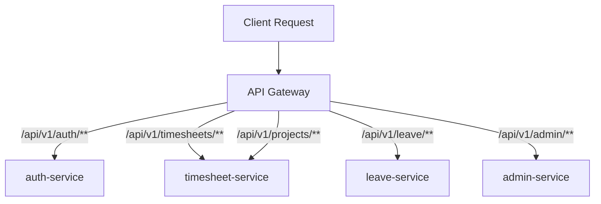

## 6. Authentication Workflow

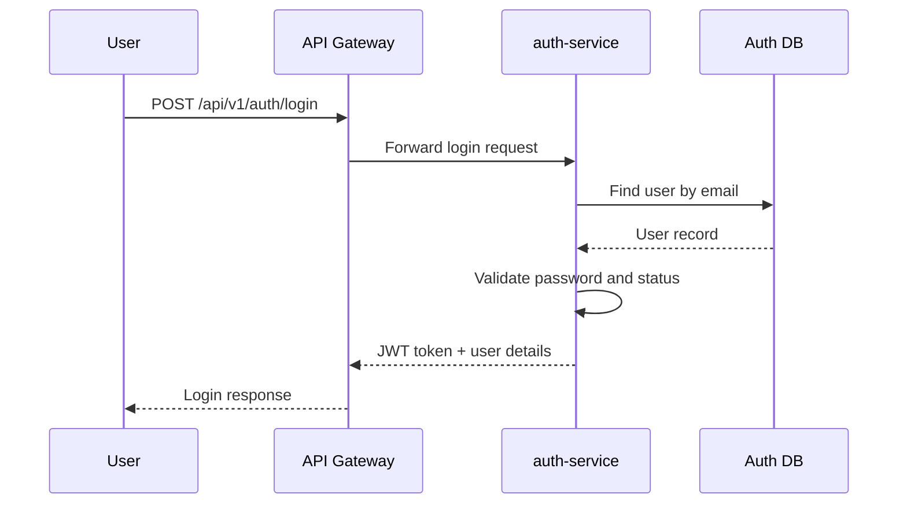

## 7. Timesheet Submission Workflow

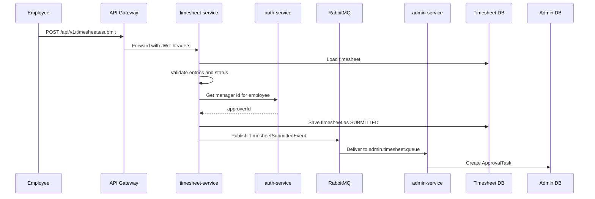

## 8. Leave Request Workflow

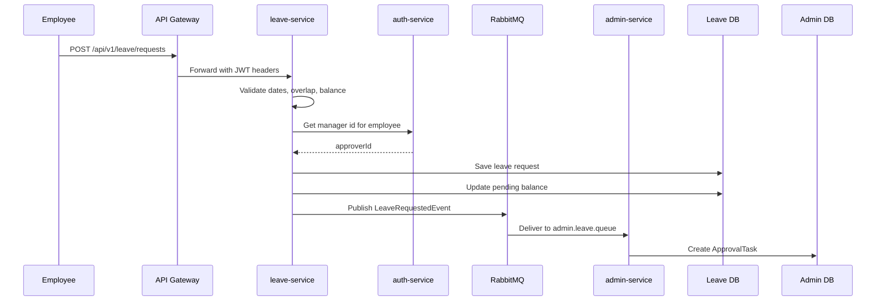

## 9. Approval Completion Workflow

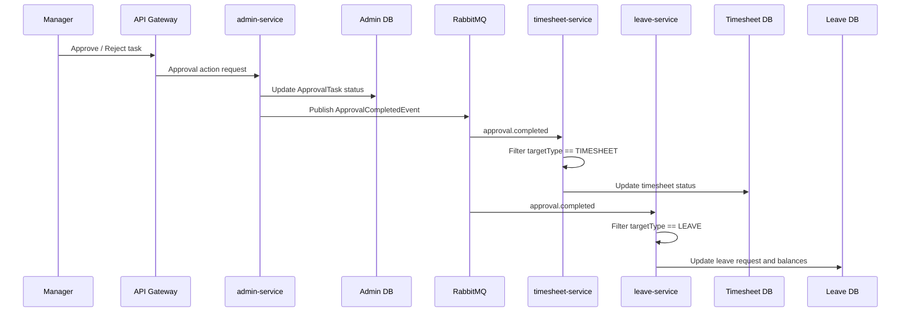

## 10. RabbitMQ High-Level View

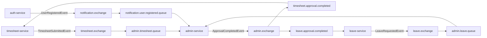

## 11. RabbitMQ Leave Approval Low-Level View

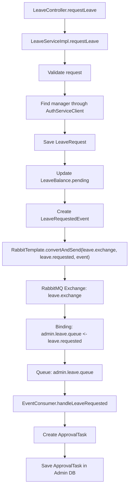

## 12. RabbitMQ Timesheet Approval Low-Level View

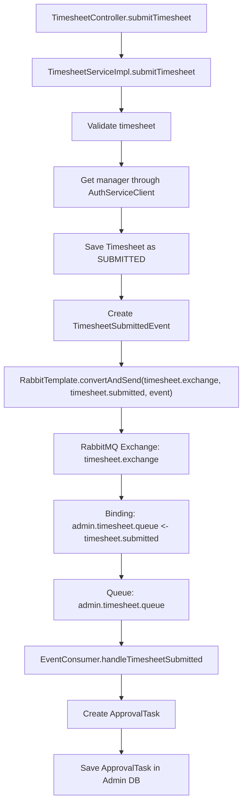

## 13. Notification Flow

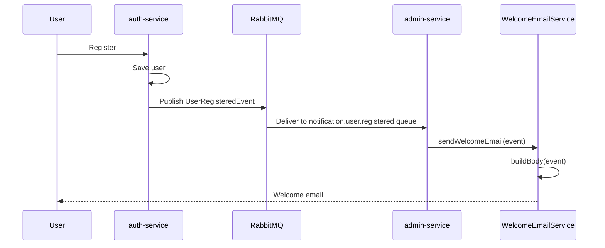

## 14. Database Ownership Diagram

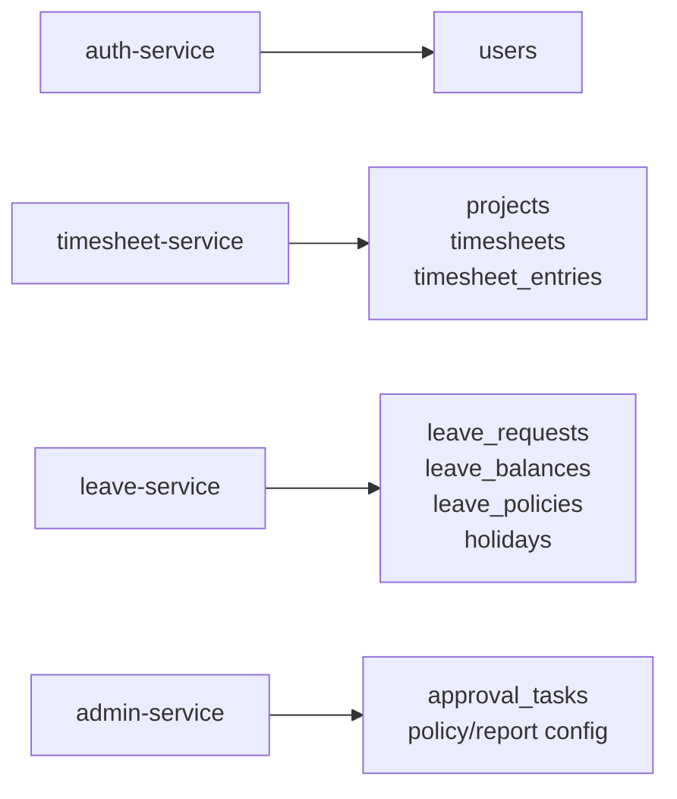

## 15. Low-Level Timesheet Service Internal Structure

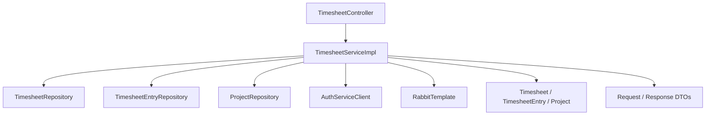

## 16. Low-Level Leave Service Internal Structure

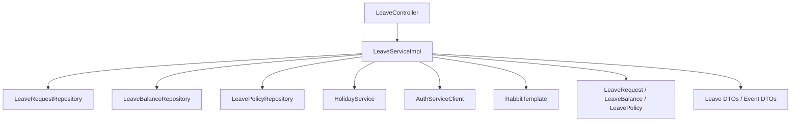

## 17. Low-Level Admin Service Internal Structure

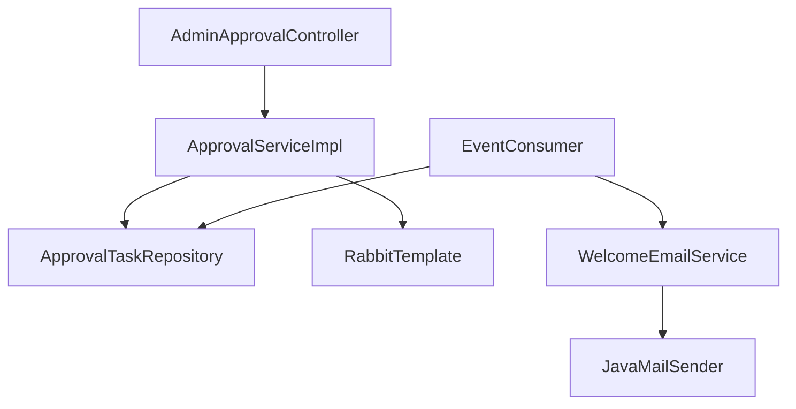

## 18. Presentation Tip

Use these diagrams in this order during explanation:

1. High-Level System Architecture
2. Service Ownership
3. API Gateway Routing View
4. Authentication Workflow
5. Leave Workflow
6. Timesheet Workflow
7. RabbitMQ High-Level View
8. One low-level workflow diagram
9. Database Ownership

